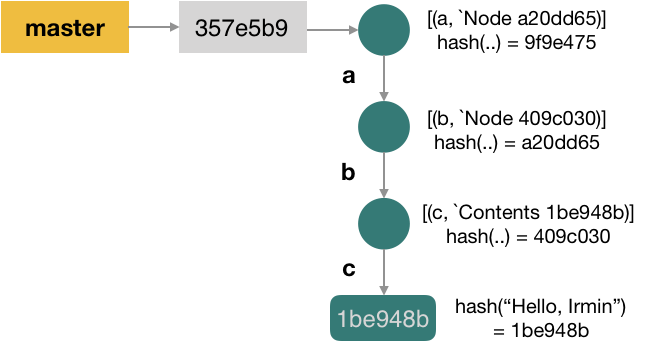
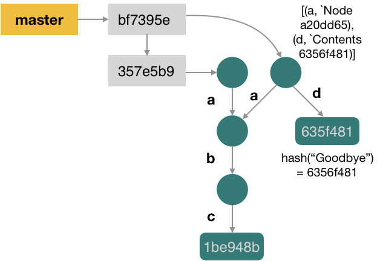

Two types of stores are used in Irmin: the **block** and the **reference**
store.

### The Block Store

This is the type of store used for the _commits_, _nodes_, and _contents_. The
block store is **persistent** and **content addressable**. **Persistence** means
that updating a data structure returns a new one, which shares its subparts as
much as possible with the original structure in order to avoid the cost of extra
allocations. A side effect is that a history of updates is maintained as well.

It is also a **content addressable** store, as _values_ (be it contents, commits,
or nodes) are stored as a pair `(hash(value), value)`. Therefore, a value can
be accessed using its hash.

Irmin contains a collection of block stores, but you can create your own
using the interface [Irmin.Content_addressable.S], as long as the following are
guaranteed:

- Reads using the same key return the same value.

- Writes of the same value return the same key.

### The Reference Store

The reference store is a mutable store used for _branches_. As in Git, branches are tags added
to commits. A default branch (`main`) is always available in Irmin. Branches
are useful when multiple processes access the store, as they keep track of the state
of each process. This type of store is also called an **atomic write** store:
two independent processes can do some local modifications, but updating the same
branch is an atomic and concurrent operation.

Branches are stored as pairs of `(hash(commit), branch)` in the reference store.

As for the block store, you can choose a reference store from the ones Irmin provides, 
or you can create your own using the interface [`Irmin.Atomic_write.S`].
The operations you have to implement need to satisfy some constraints:

- Concurrent reads of the same branch name return the same hash. Updates of a
  branch name to a given commit should be sequentially consistent. Subsequent
  reads of a branch name should always result in the last hash that has been
  written.

- Writes are implemented using two operations: `set` and `test_and_set`. `set` updates a branch name to a
  given hash but provides no guarantees in the case of concurrent writes.
`test_and_set` is a two step operation: (1) it first checks the
  current hash of a branch name, and (2) then it updates the branch name to a new
  hash. This two-step operation must be atomic to guarantee that, in case of
  concurrent writes, only the _fastest_ write updates the branch name.

  Ensuring that `test_and_set` is atomic can be difficult, as the
  POSIX interface does not provide such an operation. [`Irmin_fs_unix`] uses a
  [dotlocking] optimistic strategy (i.e., creating a file can be
  done atomically on POSIX filesystems).

### Combining the Two

Commits, nodes, contents, and branches stores combine in an Irmin store.

As we have seen in our examples so far, Irmin uses trees to store its contents.
The leaves of the tree contain the _contents_, while the _nodes_ encode the path
from the root to the contents. _Commits_ are represented as special
nodes in the tree. For instance, the contents we commited to a `Mem_store` in
the [Getting Started](/tutorial/getting-started) section:

```ocaml
let main () =
    let* repo = Mem_store.Repo.v config in
    let* t = Mem_store.main repo in
    Mem_store.set_exn t ["a"; "b"; "c"] "Hello, Irmin!" ~info:(info "my first commit")
```

These are represented as 

Let's add a new commit:

```ocaml
let new_commit t =
    Mem_store.set_exn t ["d"] "Goodbye!" ~info:(info "my second commit")
```

Then the store changes to



The `main` branch references the latest commit.

As mentioned, Irmin has a few _types_ of stores available: the in-memory store
and the Git store, as covered in the
[Getting started](/tutorial/getting-started) tutorial, but also others that you can
explore on [GitHub][github]. In the [next section](/tutorial/backend), we will
create our own Irmin stores.

<!-- prettier-ignore-start -->
[github]: https://github.com/mirage/irmin/tree/main/src
[Irmin.Content_addressable.S]: https://mirage.github.io/irmin/irmin/Irmin/module-type-Content_addressable/module-type-S/index.html
[Irmin.ATOMIC_WRITE_STORE]: https://mirage.github.io/irmin/irmin/Irmin/module-type-Atomic_write/module-type-S/index.html
[dotlocking]: http://wiki.call-cc.org/eggref/4/dot-locking
[Irmin_fs_unix]: https://mirage.github.io/irmin/irmin-fs/Irmin_fs_unix/index.html

<!-- prettier-ignore-end -->
